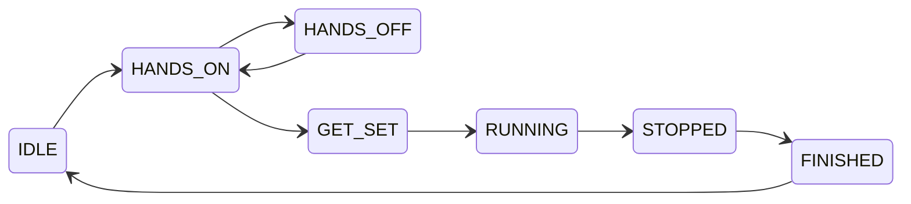

## smartcube-web-bluetooth: multi-vendor Smart Cubes & GAN Smart Timers via Web Bluetooth API

This library is designed for easy interaction with Smart Cubes (GAN, Giiker, GoCube, MoYu, QiYi) and GAN Smart Timers on platforms that support [Web Bluetooth API](https://github.com/WebBluetoothCG/web-bluetooth/blob/main/implementation-status.md).

Nature of the GAN Smart Timer and Smart Cubes is event-driven, so this library depends on [RxJS](https://rxjs.dev/), and library API provides [Observable](https://rxjs.dev/guide/observable) where you can subscribe for events.

## Installation

The project is currently hosted on GitHub:

- Repository: `https://github.com/poliva/smartcube-web-bluetooth`

You can consume it directly via npm using the GitHub URL:

```bash
npm install poliva/smartcube-web-bluetooth
```

Or, add it to your `package.json`:

```json
{
  "dependencies": {
    "smartcube-web-bluetooth": "github:poliva/smartcube-web-bluetooth"
  }
}
```

If you are upgrading from the original [gan-web-bluetooth](https://afedotov.github.io/gan-timer-display/) package:

- The existing GAN-specific APIs (`connectGanCube`, `connectGanTimer`, etc.) remain available for backwards compatibility.
- A new generic Smart Cube API (`connectSmartCube`, `SmartCubeConnection`, `SmartCubeEvent`, …) is now the recommended entry point for all brands.

## Smart Cubes

### Supported Smart Cubes

Via the generic Smart Cube API (`connectSmartCube`) this library supports:

- GAN Smart Cubes (Gen2 / Gen3 / Gen4)
- Giiker / Mi Smart / Hi- cubes
- GoCube / Rubik’s Connected
- MoYu smart cubes:
  - MoYu AI 2023 (GAN Gen2 protocol)
  - MoYu MHC smart cubes
  - MoYu WRM smart cubes (`WCU_MY3`)
- QiYi Smart Cubes and XMD Tornado V4


### Generic Smart Cube API

For new applications, use the generic Smart Cube API. It automatically detects the connected cube brand and exposes a unified event model.

Sample TypeScript code:

```typescript
import {
    connectSmartCube,
    SmartCubeConnection,
    SmartCubeEvent
} from 'smartcube-web-bluetooth';

// Connect to any supported smart cube
const conn: SmartCubeConnection = await connectSmartCube();

conn.events$.subscribe((event: SmartCubeEvent) => {
    if (event.type === "FACELETS") {
        console.log("Cube facelets state", event.facelets);
    } else if (event.type === "MOVE") {
        console.log("Cube move", event.move, "face", event.face, "direction", event.direction);
    } else if (event.type === "GYRO") {
        console.log("Cube orientation quaternion", event.quaternion);
    } else if (event.type === "BATTERY") {
        console.log("Battery level", event.batteryLevel);
    }
});

// Request current facelets / battery if supported
if (conn.capabilities.facelets) {
    await conn.sendCommand({ type: "REQUEST_FACELETS" });
}
if (conn.capabilities.battery) {
    await conn.sendCommand({ type: "REQUEST_BATTERY" });
}
```

### GAN-specific Smart Cube API (legacy)

The original GAN-only APIs are still available for existing applications and continue to work on top of the new implementation:

Sample TypeScript code:
```typescript
import { connectGanCube } from 'smartcube-web-bluetooth';

var conn = await connectGanCube();

conn.events$.subscribe((event) => {
    if (event.type == "FACELETS") {
        console.log("Cube facelets state", event.facelets);
    } else if (event.type == "MOVE") {
        console.log("Cube move", event.move);
    }
});

await conn.sendCubeCommand({ type: "REQUEST_FACELETS" });
```

## GAN Smart Timers

Supported GAN timer devices:
- GAN Smart Timer
- GAN Halo Smart Timer

Sample application how to use this library with GAN Smart Timer can be found here:
- https://github.com/afedotov/gan-timer-display
- Live version: [GAN Timer Display](https://afedotov.github.io/gan-timer-display/)

Sample TypeScript code:
```typescript
import { connectGanTimer, GanTimerState } from 'gan-web-bluetooth';

var conn = await connectGanTimer();

conn.events$.subscribe((timerEvent) => {
    switch (timerEvent.state) {
        case GanTimerState.RUNNING:
            console.log('Timer is started');
            break;
        case GanTimerState.STOPPED:
            console.log(`Timer is stopped, recorded time = ${timerEvent.recordedTime}`);
            break;
        default:
            console.log(`Timer changed state to ${GanTimerState[timerEvent.state]}`);
    }
});
```

You can read last times stored in the timer memory:
> Please note that you should not use `getRecordedTimes()` in polling fashion 
> to get currently displayed time. Timer and its bluetooth protocol does not designed for that.
```typescript
var recTimes = await conn.getRecordedTimes();
console.log(`Time on display = ${recTimes.displayTime}`);
recTimes.previousTimes.forEach((pt, i) => console.log(`Previous time ${i} = ${pt}`));
```

#### Possible timer states and their description:

State | Description
-|-
IDLE | Timer is reset and idle
HANDS_ON | Hands are placed on the timer
HANDS_OFF | Hands removed from the timer before grace delay expired
GET_SET | Grace delay is expired and timer is ready to start
RUNNING | Timer is running
STOPPED | Timer is stopped, this event includes recorded time
FINISHED | Move to this state immediately after STOPPED
DISCONNECT | Fired when timer is disconnected from bluetooth


#### Timer state diagram:



Since internal clock of the most GAN Smart Cubes is not ideally calibrated, they typically introduce 
noticeable time skew with host device clock. Best practice here is to record timestamps of move events 
during solve using both clocks - host device and cube. Then apply linear regression algorithm 
to fit cube timestamp values and get fairly measured elapsed time. This approach is invented 
and firstly implemented by **Chen Shuang** in the **csTimer**. This library also contains `cubeTimestampLinearFit()` 
function to accomplish such procedure. You can look into the mentioned sample application code for details, 
and this [Jupyter notebook](https://github.com/afedotov/scipy-notebooks/blob/main/ts-linregress.ipynb) for visualisation
of such approach.